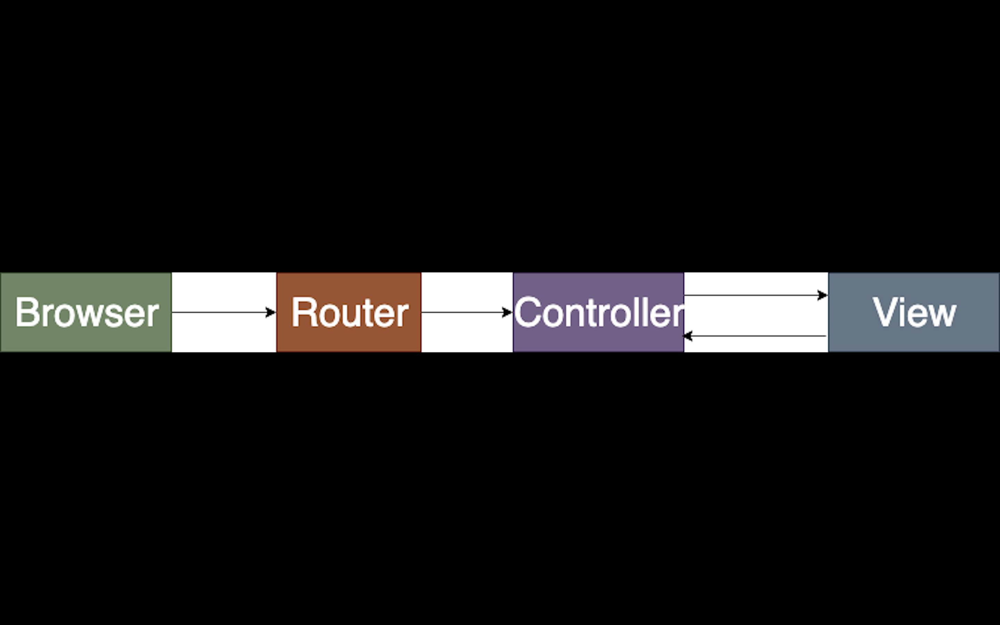

## Full stack request response cycle

What will happen a user opens his browser, types in a URL, and presses Enter.

_The web is a cycle of requests and responses that flow between clients and servers._

1.  You enter a URL into a web browser
2.  The browser looks up the IP address for the domain name via DNS
3.  The browser sends a HTTP _request_ to the server
4.  The server sends back a HTTP _response_
5.  The browser begins rendering the HTML
6.  The browser sends requests for additional objects embedded in HTML (images, css, JavaScript) and repeats steps 3-5.
7.  Once the page is loaded, the browser sends further async requests as needed.

Before discussing **what happens after hitting the URL**, we must go through what a URL actually is, and what different parts of the URL mean - right? Without wasting any time, let’s understand more about URLs.

**URL – Uniform Resource Locator**

If you look into its full form, then it is self explanatory: it has the location of the resources which we want to access. It is an **address of the place** where we want to go to interact with or find information.
Now, we know what a URL is but we still don’t know about the parts of a URL. Let’s go!

Let’s take an example:

[https://www.example.com/page1](https://www.example.com/page1)

Here, the first part is **‘https’**. This basically tells the browser which protocol it should use. It can be **http, https, ftp,** etc. A **protocol** is a **set of rules** that browser use for communication over the network. **'https'** is basically a **secure version**, i.e. information is exchanged in a secure way. The second part **www.example.com** is a **domain name**.

**Difference between URL and Domain Name**

The major difference between both is that the **URL is a complete address**. URL tells about the method through which information should exchange, the path after reaching that website. Whereas the **domain name is part of a URL**.

**Domain Name Server (DNS)**

Domain Name Server (DNS) matches “wsvincent.com” to an IP address

Why can’t we use IP address to get content of the website?

Yes! You can **use IP addresses** to **get content** of the website but really!.. Would you be able to remember each website’s associated IP address? Obviously not! It’s **hard** to **remember the IP address** of every website. That’s why domain names came into the market.

You can relate it to your contact list. You can’t remember every person’s number, but you can remember their name. Same concept applies here as well. You **can’t remember** those scary **IP addresses**, but you can easily **remember** **domain names**.

1. After hitting the URL, the **browser cache** is checked. As browser maintains its DNS records for some amount of time for the websites you have visited earlier. Hence, firstly, DNS query runs here to find the IP address associated with the domain name.

2. The second place where DNS query runs in **OS cache** followed by **router cache**.

3. If in the above steps, a DNS query does not get resolved, then it takes the help of resolver server. Resolver server is nothing but your ISP (Internet service provider). The query is sent to ISP where DNS query runs in **ISP cache.**

4. If in 3rd steps as well, no results found, then request sends to **top or root server** of the DNS hierarchy. There it never happens that it says no results found, but actually it tells, from where this information you can get. If you are searching IP address of the top level domain (.com,.net,.Gov,. org). It tells the resolver server to search **TLD server** (Top level domain).

5. Now, resolver asks TLD server to give IP address of our domain name. TLD stores address information of domain name. It tells the resolver to ask it to **Authoritative Name server.**

6. The authoritative name server is responsible for knowing everything about the domain name. Finally, resolver (ISP) gets the IP address associated with the domain name and sends it back to the browser.

After getting an IP address, resolver stores it in its cache so that next time, if the same query comes then it does not have to go to all these steps again. It can now provide IP address from their cache.

**TCP connection initiates with the server by Browser**

Once the **IP address** of the computer (where your website information is there) is **found**, it **initiates connection** with it. To communicate over the network, **internet protocol** is followed. **TCP/IP** is most common protocol. A connection is built between two using a process called **‘TCP 3-way handshake’**. Let’s understand the process in brief:

1. A client computer sends a **SYN message** means, whether second computer is open for new connection or not.

2. Then **another computer**, if open for new connection, it sends **acknowledge message** with SYN message as well.

3. After this, **first computer** receives its message and acknowledge by **sending** an **ACK message.**

**What is an HTTP request?**

A HTTP request is a text string generated by the client and sent to the server containing the specifications of the resource the client is asking for. A resource is anything that can accessed via the web. The HTTP request communicates _which_ resource a client wants to interact with and _how_ the client wants to interact with it, along with some metadata held in the header related to the request.

The resource the client wants to interact with is communicated through the URL that is sent with the request. For example, if a user entered [http://twitter.com](http://google.com/) into their web browser, the web browser would send a request to the server looking for the Twitter resource.

**What are the different types of request methods that can be included in an HTTP request?**

How the user wants to interact with the resource is communicated through the request method. Four of the most common request methods are GET, POST, PUT, and DELTE.

GET requests generally ask for the resource to be returned unchanged. Sending a request to for the homepage of Twitter would be a GET request.

POST requests are used to make a submission to the resource. This type of request would typically ask the server to store new information, for example by writing it to a database. Posting a new tweet would be an example of a POST request.

PUT requests are used to update a resource. Editing a tweet would be an example of a PUT request.

DELETE requests are used to remove a resource. For example, deleting a tweet would be an example of a DELETE request

**What is an HTTP response?**

An HTTP response is what is sent by a server to a client in response to an HTTP request. These responses contain a status code and if the request was successful, the requested resource. An example status code for a successful request would be “200” and an example status code for an unsuccessful request would be “404”. Other common status codes include “300” for redirects and “500” for server errors.

**Request Response Process**

Finally, the connection is built between client and server. Now, they both can communicate with each other and share information. After successful connection, **browser (client)** sends a **request** to a **server** that I want this content. The server knows everything of what response it should send for every request. Hence, the **server responds back.** This response contains every information that you requested like web page, status-code, cache-control, etc. Now, the browser renders the content that has been requested.
Each subsequent request completes a request/response cycle and is rendered in turn by the browser.
